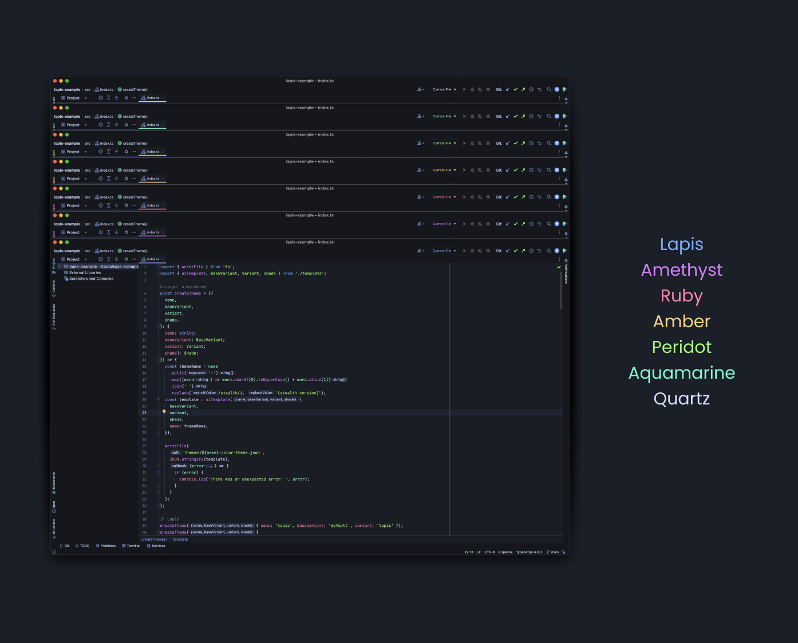

<!-- Plugin description -->

A dark blue inspired theme for JetBrains IDEs with 7 accent / button color variations.

<a href="https://github.com/aslbarnett/lapis-jetbrains">Repository</a>&nbsp;&nbsp;|&nbsp;&nbsp;<a href="https://github.com/aslbarnett/lapis-jetbrains/issues">Issues</a>

<!-- Plugin description end -->

## 🛳 Lapis Theme Ports

- [Lapis Visual Studio Code](https://marketplace.visualstudio.com/items?itemName=AlexBarnett.lapis-vscode)
- [Lapis Terminal.app](https://github.com/aslbarnett/lapis-theme-terminal-app)
- [Lapis Slack](https://github.com/aslbarnett/lapis-theme-slack)
- [Lapis Google Chrome](https://chrome.google.com/webstore/detail/lapis-chrome-theme/hmcmhgomamidaaodladnploplghibodb)

## 📝 Feedback

If you see any issues with the theme, please [open an issue](https://github.com/aslbarnett/lapis-jetbrains/issues).
